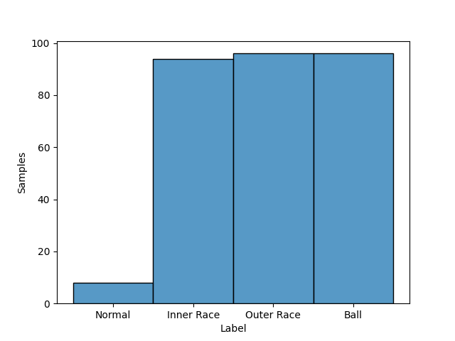
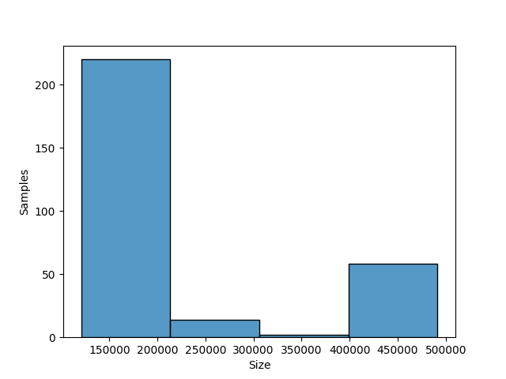
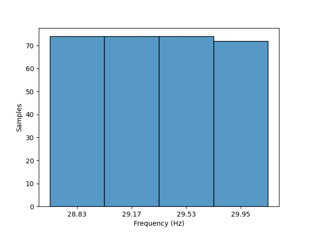

# CWRU

## Dataset Description
This dataset provides access to ball bearing test data for normal and faulty bearings.  
Experiments were conducted using a 2 hp Reliance Electric motor, and acceleration data was measured at locations near to and remote from the motor bearings.

## Dataset Structure

- All data files are in Matlab (*.mat) format.

- Rotation: 28.83 ~ 29.95 Hz

- Classes: Normal, Inner Race, Outer Race and Ball

- Domain: Time

- Sample rate: 12000 samples per second and 48000 samples per second

## Summary

#### Label distribution
|   Label    | Number samples |
|:----------:|:--------------:|
|   Normal   |       8        |
| Inner Race |       94       |
| Outer Race |       96       |
|    Ball    |       96       |
| **Total**  |      294       |

#### Signal size distribution
|   Size    | Number samples |
|:---------:|:--------------:|
|  122136   |       21       |
|  121991   |       24       |
|  121351   |       24       |
|  485643   |       6        |
|  121265   |       3        |
|  122917   |       3        |
|  243938   |       4        |
|  486224   |       8        |
|  122571   |       6        |
|  121410   |       6        |
|  121556   |       9        |
|  244739   |       2        |
|  487384   |       6        |
|  486804   |       12       |
|  488545   |       4        |
|  122426   |       6        |
|  243538   |       2        |
|  487964   |       4        |
|  121846   |       21       |
|  121701   |       6        |
|  381890   |       2        |
|  485063   |       6        |
|  249146   |       2        |
|  245140   |       2        |
|  484483   |       4        |
|  244339   |       2        |
|  491446   |       2        |
|  489125   |       2        |
|  121168   |       30       |
|  121535   |       15       |
|  120801   |       6        |
|  121719   |       6        |
|  122086   |       3        |
|  122269   |       3        |
|  121902   |       3        |
|  120984   |       9        |
|  120617   |       9        |
|  483903   |       2        |
|  122281   |       3        |
|  128663   |       2        |
|  489705   |       2        |
|  130549   |       2        |
| **Total** |      294       |

#### Rotatory frequency distribution
| Frequency (Hz) | Number samples |
|:--------------:|:--------------:|
|     28.83      |       74       |
|     29.95      |       72       |
|     29.16      |       74       |
|     29.53      |       74       |
|   **Total**    |      294       |

