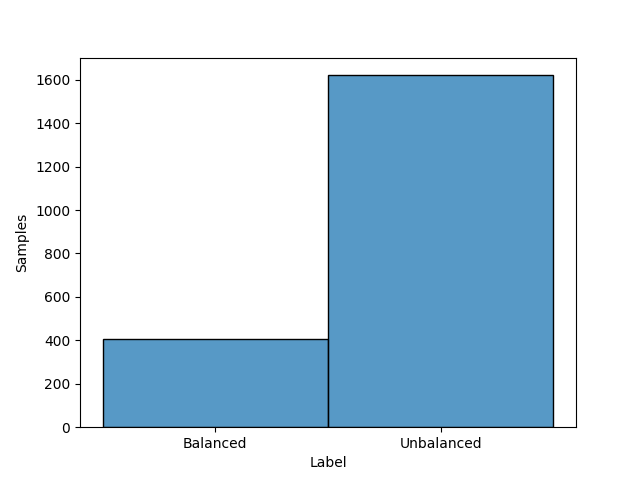
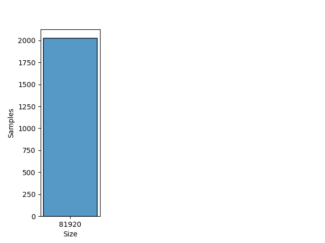

# EAS

## Dataset Description
This dataset contains vibration data recorded on a rotating drive train. This drive train consists of an electronically commutated DC motor and a shaft driven by it, which passes through a roller bearing. With the help of a 3D-printed holder, unbalances with different weights and different radii were attached to the shaft. Besides the strength of the unbalances, the rotation speed of the motor was also varied. This dataset can be used to develop and test algorithms for the automatic detection of unbalances on drive trains.

Datasets for 4 differently sized unbalances and for the unbalance-free case were recorded. The vibration data was recorded at a sampling rate of 4096 values per second. Datasets for development (ID "D[0-4]") as well as for evaluation (ID "E[0-4]") are available for each unbalance strength. The rotation speed was varied between approx. 630 and 2330 RPM in the development datasets and between approx. 1060 and 1900 RPM in the evaluation datasets. For each measurement of the development dataset there are approx. 107min of continuous measurement data available, for each measurement of the evaluation dataset 28min.

## Dataset Structure

- The dataset contains one csv file per measurement. All files are packed into one zip-file.

- Rotation Speed: 630 ~ 2330 RPM (Development Dataset) and 1060 ~ 1900 RPM (Evaluation Datasets)

- Classes: Balanced and Unbalanced

- Domain: Time

- Sample Rate: 4096 samples per second

## Summary

#### Label distribution
|       Label          | Number samples |
|:--------------------:|:--------------:|
|      Balanced        |                |
|      Unbalanced      |                |
|      **Total**       |                |

<!--  -->

#### Signal size distribution
|   Size    | Number samples |
|:---------:|:--------------:|
|           |                |
| **Total** |                |

<!--  -->
