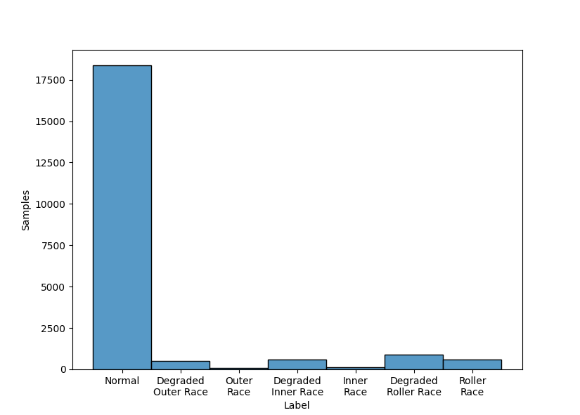
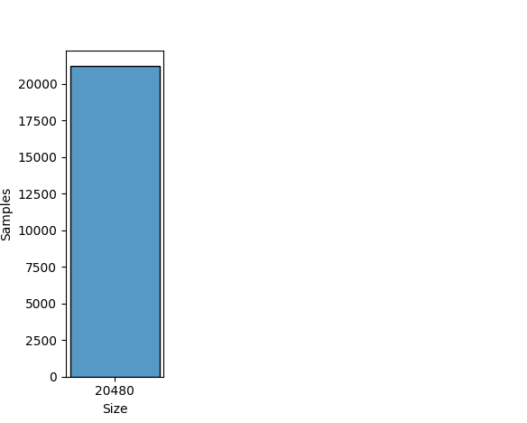

# IMS

## Dataset Description
Four bearings were installed on a shaft. The rotation speed was kept constant at 2000 RPM by an AC motor coupled to the shaft via rub belts. A radial load of 6000 lbs is applied onto the shaft and bearing by a spring mechanism. All bearings are force lubricated.

## Dataset Structure

- Three data sets are included in the data packet (IMS-Rexnord Bearing Data.zip). Each data set describes a test-to-failure experiment. Each data set consists of individual files that are 1-second vibration signal snapshots recorded at specific intervals. Each file consists of 20,480 points with the sampling rate set at 20 kHz. The file name indicates when the data was collected. Each record (row) in the data file is a data point. Data collection was facilitated by NI DAQ Card 6062E. Larger intervals of time stamps (showed in file names) indicate resumption of the experiment in the next working day.

- Rotation Speed: 2000 RPM

- Classes: Normal, Degraded Outer Race, Outer Race, Degraded Inner Race, Inner Race, Degraded Roller Race and Roller Race

- Domain: Time

- Sample Rate: 20000 samples per second

## Summary

#### Label distribution
|        Label         | Number samples |
|:--------------------:|:--------------:|
|        Normal        |     18392      |
| Degraded Outer Race  |      500       |
|      Outer Race      |       68       |
| Degraded Inner Race  |      600       |
|      Inner Race      |      112       |
| Degraded Roller Race |      900       |
|     Roller Race      |      612       |
|      **Total**       |     21184      |

#### Signal size distribution
|   Size    | Number samples |
|:---------:|:--------------:|
|   20480   |     21184      |
| **Total** |     21184      |

