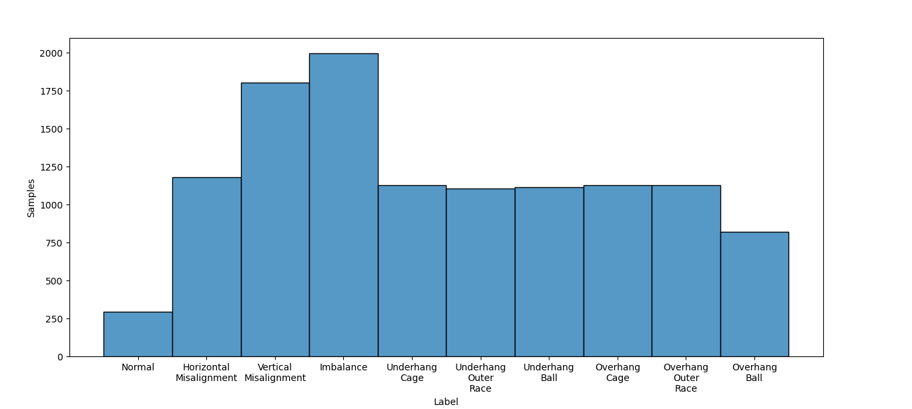
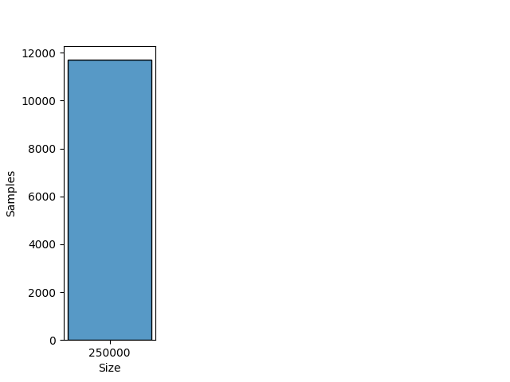
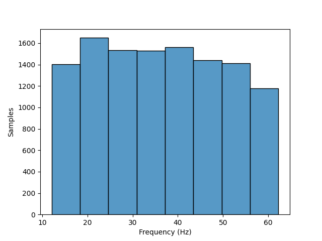

# MAFAULDA

## Dataset Description
This database is composed of 1951 multivariate time-series acquired by sensors on a SpectraQuest's Machinery Fault Simulator (MFS) Alignment-Balance-Vibration (ABVT). The 1951 comprises six different simulated states: normal function, imbalance fault, horizontal and vertical misalignment faults and, inner and outer bearing faults.

## Dataset Structure

- The database is composed by several CSV (Comma-Separated Values) files, each one with 8 columns, one column for each sensor, according to:

    - Column 1: Tachometer signal that allows to estimate rotation frequency;

    - Columns 2 to 4: Underhang bearing accelerometer (axial, radiale tangential direction);

    - Columns 5 to 7: Overhang bearing accelerometer (axial, radiale tangential direction);

    - Column 8: microphone.

- Rotation Speed: 700 ~ 3600 RPM

- Rotation Frequency: 12.08 ~ 62.26 Hz

- Classes: Normal, Horizontal Misalignment, Vertical Misalignment, Imbalance, Underhang Cage Fault, Underhang Outer Race, Underhang Ball Fault, Overhang Cage Fault, Overhang Outer Race and Overhang Ball Fault.

- Domain: Time

- Sample rate: 50000 samples per second

## Summary

#### Label distribution
|           Label           | Number samples |
|:-------------------------:|:--------------:|
|          Normal           |      294       |
|  Horizontal Misalignment  |      1182      |
|   Vertical Misalignment   |      1806      |
|         Imbalance         |      1998      |
|      Underhang Cage       |      1128      |
|   Underhang Outer Race    |      1104      |
|      Underhang Ball       |      1116      |
|       Overhang Cage       |      1128      |
|    Overhang Outer Race    |      1128      |
|       Overhang Ball       |      822       |
|         **Total**         |     11706      |

#### Signal size distribution
|   Size    | Number samples |
|:---------:|:--------------:|
|  250000   |     11706      |
| **Total** |     11706      |

#### Rotatory frequency distribution
| Frequency (Hz)  | Number samples |
|:---------------:|:--------------:|
|  12.08 ~ 62.26  |     11706      |
|    **Total**    |     11706      |

