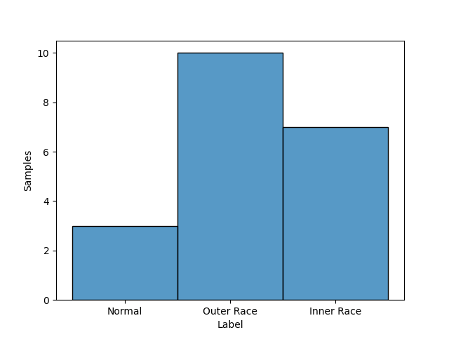
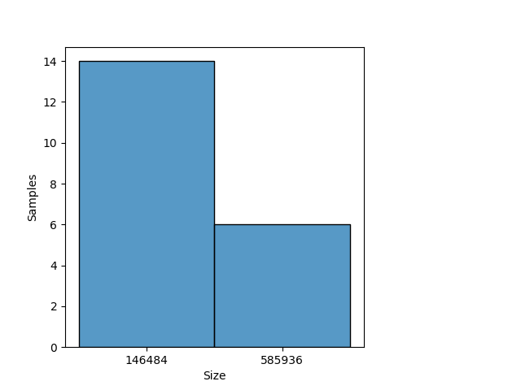
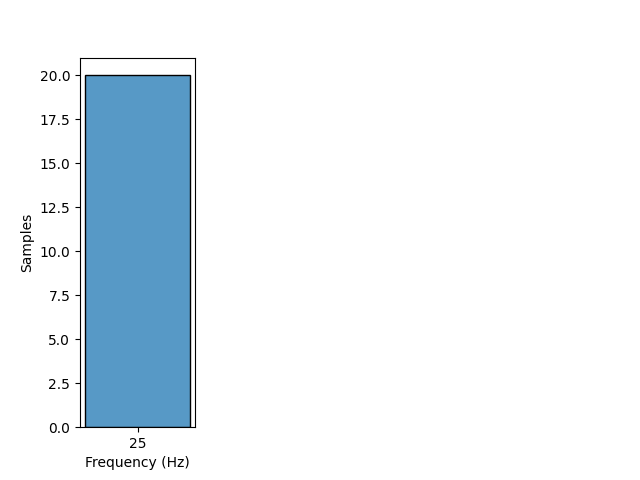

# MFPT

## Dataset Description
This dataset provides access to bearing fault test to facilitate research into bearing analysis. The dataset comprises data from a bearing test rig (nominal bearing data, an outer race fault at various loads, and inner race fault and various loads), and three real-world faults.

## Dataset Structure

- All data files are in Matlab double-precision (*.mat) format. The data structure holds the load, shaft rate, sample rate and a vector data.

- Rotation Speed: 1500 RPM

- Rotation Frequency: 25 Hz

- Classes: Normal, Inner Race and Outer Race

- Domain: Time

- Sample Rate: 48828 and 97656 samples per second

## Summary

#### Label distribution
|   Label    | Number samples |
|:----------:|:--------------:|
|   Normal   |       3        |
| Inner Race |       7        |
| Outer Race |       10       |
| **Total**  |       20       |

#### Signal size distribution
|   Size    | Number samples |
|:---------:|:--------------:|
|  146484   |       14       |
|  585936   |       6        |
| **Total** |       20       |

#### Rotatory frequency distribution
| Frequency (Hz) | Number samples |
|:--------------:|:--------------:|
|       25       |       20       |
|   **Total**    |       20       |

