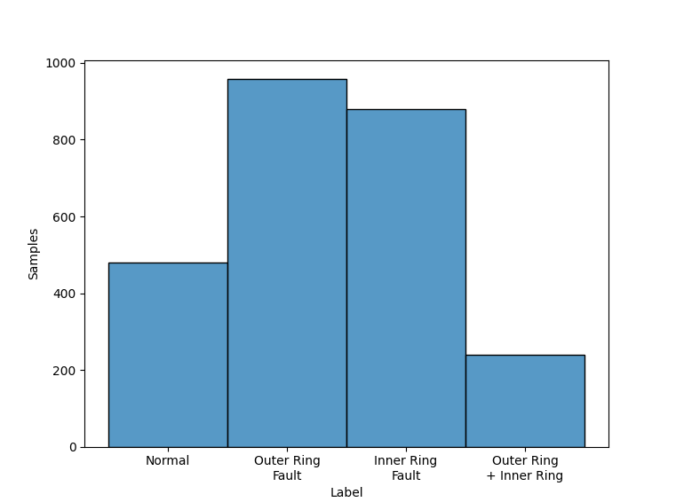
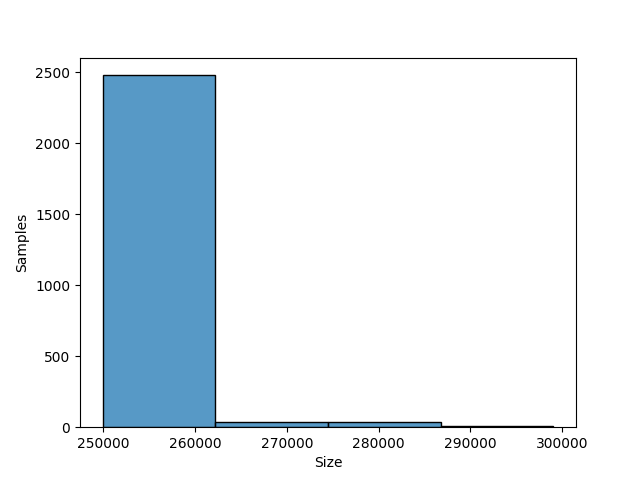
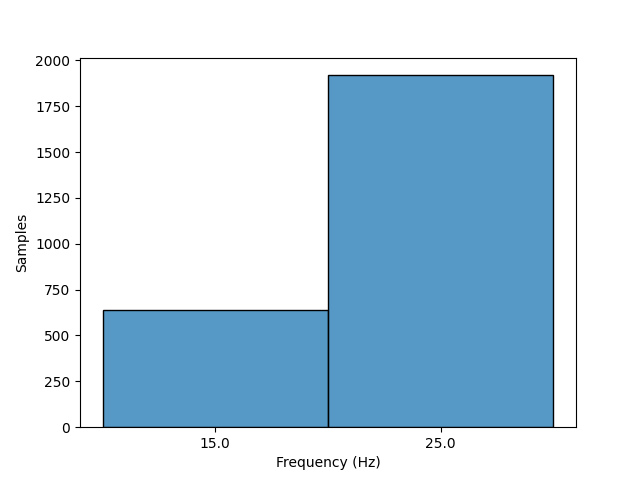

# PU

## Dataset Description
- Synchronously measured motor currents and vibration signals with high resolution and sampling rate of 26 damaged bearing states and 6 undamaged (healthy) states for reference.
- Supportive measurement of speed, torque, radial load, and temperature.
- In total, experiments with 32 different bearing damages in ball bearings of type 6203 were performed:
    
    - Undamaged (healthy) bearings (6x)

    - Artificially damaged bearings (12x)

    - Bearings with real damages caused by accelerated lifetime tests (14x)

## Dataset Structure

- 20 measurements of 4 seconds each for each setting, saved as a MatLab file with a name consisting of the code of the operating condition and the four-digit bearing code (e.g. N15_M07_F10_KA01_1.mat).

- Rotation Speed: 900 ~ 1500 RPM

- Rotation Frequency: 15 ~ 25 Hz

- Classes: Normal, Outer Ring Fault, Inner Ring Fault and Outer Ring + Inner Ring Fault

- Domain: Time

- Sample Rate: 64000 samples per second

## Summary

#### Label distribution
|          Label          | Number samples |
|:-----------------------:|:--------------:|
|         Normal          |      480       |
|    Outer Ring Fault     |      959       |
|    Inner Ring Fault     |      880       |
| Outer Ring + Inner Ring |      240       |
|        **Total**        |      2559      |

#### Signal size distribution
|      Size       | Number samples |
|:---------------:|:--------------:|
| 249940 ~ 299038 |      2559      |
|    **Total**    |      2559      |

#### Rotatory frequency distribution
| Frequency (Hz) | Number samples |
|:--------------:|:--------------:|
|       15       |      640       |
|       25       |      1919      |
|   **Total**    |      2559      |

