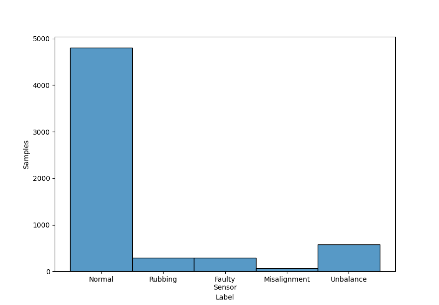
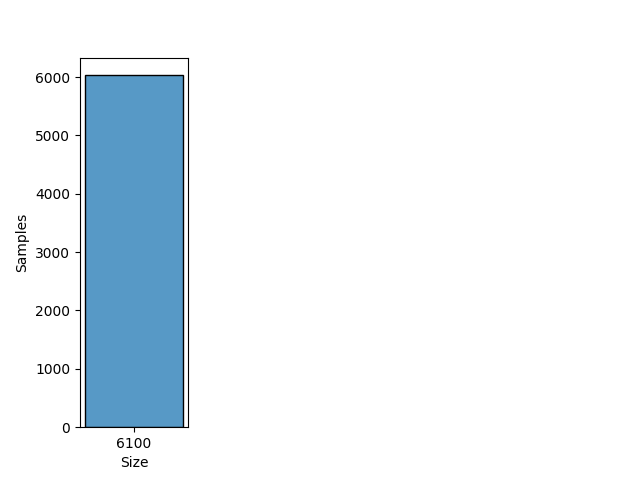
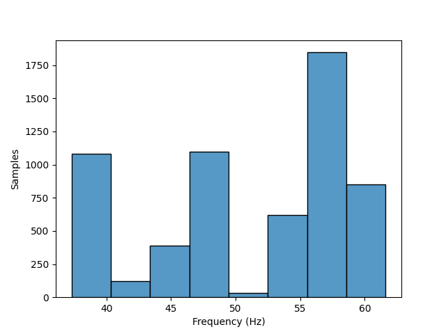

# RPDBCS

## Dataset Description
This is a real-world dataset for vibration-based fault diagnosis of electric submersible pumps used on offshore oil exploration. The ESPset dataset is a collection of vibration signals acquired from accelerometers strategically attached onto the components of Eletrical Submersible Centrifugal Pumps (ESP). An ESP belong to a class of equipment used in the extraction and exploration of oil and gas subject to severe working conditions. An ESP system consists of a coupled set of one or more electric motors, pumps and protectors.

## Dataset Structure

- The dataset is provided in two files: spectrum.csv and features.csv

    - The file 'spectrum.csv' is a matrix of 6032 lines and 12103 columns, whose values are float numbers seperated by a ';'. Each line of this file contains the spectrum of a single vibration signal collected from a sensor at a specific test condition of the ESP. Each value is the amplitude in inches per second (velocity) at a specific frequency. Each signal is normalized by the rotation frequency in which the ESP operates, in such a way that the amplitude with respect to the rotation frequency is always at the same position for all signal arrays.

    - The file 'features.csv' of 6033 lines (one line for each signal + a header), contains some features and the labels for all signals.

        - esp_id: The id of the ESP.

        - label: The classification. Let F be defined as the rotation frequency in which the BCS is operated. Each feature is defined as:

        - median(3,5): Median of the amplitudes in the interval (3Hz, 5Hz);

        - median(F-1,F+1): Median of the amplitudes in the interval (F-1Hz, F+1Hz);

        - a: Coefficient a of the exponential regression of type e^(aX+b) where X is an array of equally separated frequencies from 5Hz to 19Hz.

        - b: Coefficient b of the exponential regression of type e^(aX+b) in the interval (5Hz, 19Hz);

        - rotation1x: Frequency in Hz of the highest amplitude in the interval (F-3Hz, F-0.2Hz);

        - peak1x: Amplitude in rotation1x;

        - peak2x: Amplitude in 2*rotation1x;

        - rms(F-1,F+1): Root mean square of the amplitudes in the interval (F-1, F+1).

- Rotation Frequency: 37.29 ~ 61.61 Hz

- Classes: Normal, Rubbing, Faulty Sensor, Misalignment and Unbalance

- Domain: Time

## Summary

#### Label distribution
|       Label          | Number samples |
|:--------------------:|:--------------:|
|     Normal           |    4801        |
|     Rubbing          |    290         |
|     Faulty Sensor    |    295         |
|     Misalignment     |    70          |
|     Unbalance        |    576         |
|      **Total**       |    6032        |

#### Signal size distribution
|   Size    | Number samples |
|:---------:|:--------------:|
|   6100    |     6032       |
| **Total** |     6032       |

#### Rotatory frequency distribution
| Frequency (Hz) | Number samples |
|:--------------:|:--------------:|
| 37.29 ~ 61.61  |     6032       |
|   **Total**    |     6032       |

