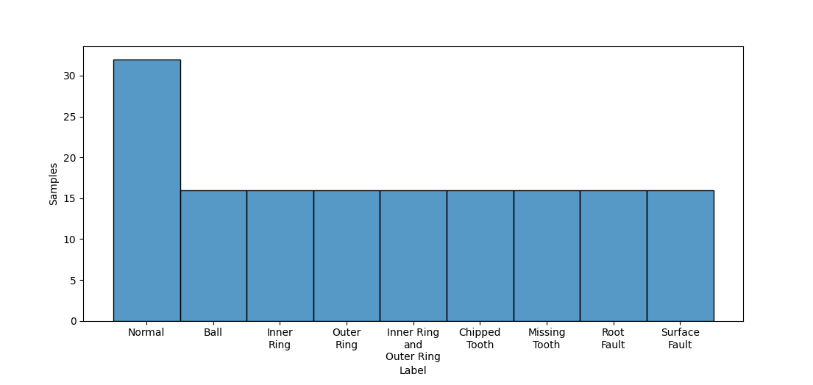
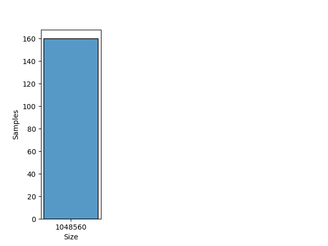
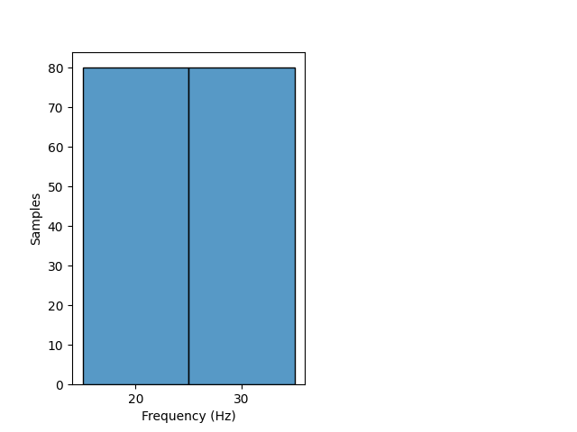

# SEU

## Dataset Description
This dataset is from Southeast University, China. These data are collected from Drivetrain Dynamic Simulator. This dataset contains 2 subdatasets, including bearing data and gear data, which are both acquired on Drivetrain Dynamics Simulator (DDS). There are two kinds of working conditions with rotating speed - load configuration set to be 20-0 and 30-2.

## Dataset Structure

- Within each file, there are 8 rows of signals which represent: 

    1 - Motor vibration

    2,3,4 - Vibration of planetary gearbox in three directions: x, y, and z

    5 - Motor torque

    6,7,8 - Vibration of parallel gear box in three directions: x, y, and z
    
    Signals of rows 2,3,4 are all effective.

- Rotation: Hz

- Classes: 

- Domain: Time

- Sample rate:  samples per second

## Summary

#### Label distribution
|       Label          | Number samples |
|:--------------------:|:--------------:|
|                      |                |
|                      |                |
|                      |                |
|                      |                |
|                      |                |
|      **Total**       |                |

<!--  -->

#### Signal size distribution
|   Size    | Number samples |
|:---------:|:--------------:|
|           |                |
| **Total** |                |

<!--  -->

#### Rotatory frequency distribution
| Frequency (Hz) | Number samples |
|:--------------:|:--------------:|
|                |                |
|                |                |
|                |                |
|   **Total**    |                |

<!--  -->
