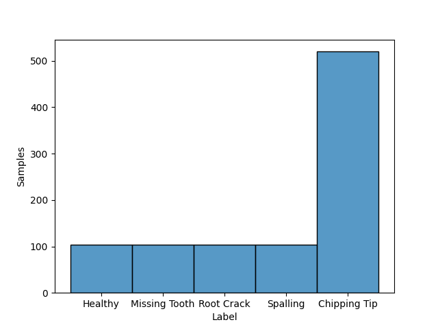
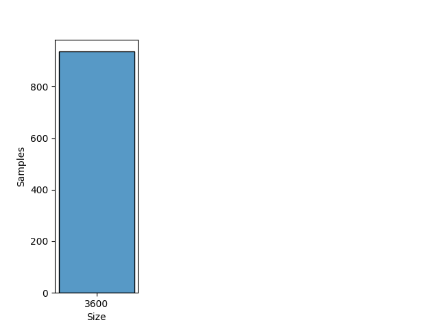

# UOC

## Dataset Description
Time domain gear fault vibration data and gear fault data after angle-frequency domain synchronous analysis.

## Dataset Structure

- All data files are in Matlab (*.mat) format.

- Classes: Healthy, Missing Tooth, Root Crack, Spalling and Chipping Tip.

- Domain: Time

- Sample Rate: 20000 samples per second

## Summary

#### Label distribution
|       Label          | Number samples |
|:--------------------:|:--------------:|
|   Healthy            |      104       |
|   Missing Tooth      |      104       |
|   Root Crack         |      104       |
|   Spalling           |      104       |
|   Chipping Tip       |      520       |
|      **Total**       |      936       |

#### Signal size distribution
|   Size    | Number samples |
|:---------:|:--------------:|
|   3600    |      936       |
| **Total** |      936       |

