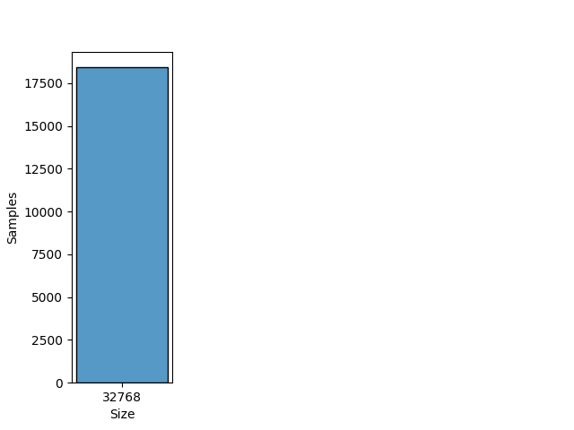
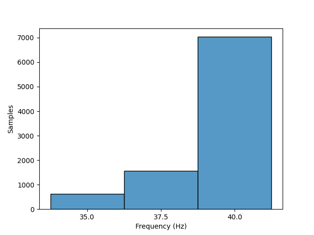

# XJTU

## Dataset Description
The datasets contain complete run-to-failure data of 15 rolling element bearings that were acquired by conducting many accelerated degradation experiments. These datasets are publicly available and anyone can use them to validate prognostics algorithms of rolling element bearings.

Publications making use of the XJTU-SY bearing datasets are requested to cite the following paper:
- Biao Wang, Yaguo Lei, Naipeng Li, Ningbo Li, “A Hybrid Prognostics Approach for Estimating Remaining Useful Life of Rolling Element Bearings”, IEEE Transactions on Reliability, vol. 69, no. 1, pp. 401-412, 2020.)

## Dataset Structure

- The run-to-failure data of 15 rolling element bearings are included in the data packet (XJTU-SY_Bearing_Datasets.zip). For each sampling, the acquired data were saved as a CSV file, in which the first column is the horizontal vibration signals and the second column is the vertical vibration signals.

- Rotation Speed: 2100 ~ 2400 RPM

- Rotation Frequency: 35 ~ 40 Hz

- Classes: Inner Race, Outer Race and Cage

- Domain: Time

- Sample rate: 25600 samples per second

## Summary

#### Label distribution
|   Label    | Number samples |
|:----------:|:--------------:|
| Inner Race |       2377     |
| Outer Race |       3636     |
|    Cage    |       655      |
|    NaN     |       2548     |
| **Total**  |       9216     |

#### Signal size distribution
|   Size    | Number samples |
|:---------:|:--------------:|
|   32768   |      9216      |
| **Total** |      9216      |

#### Rotatory frequency distribution
| Frequency (Hz) | Number samples |
|:--------------:|:--------------:|
|       35       |      616       |
|      37.5      |      1566      |
|       40       |      7034      |
|   **Total**    |      9216      |

